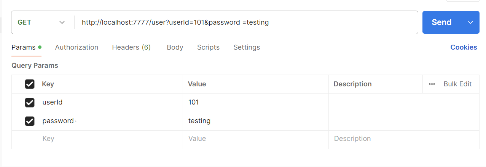
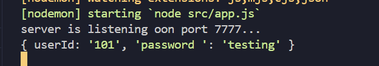
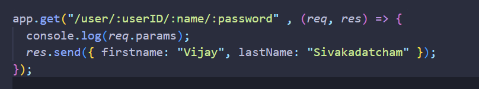
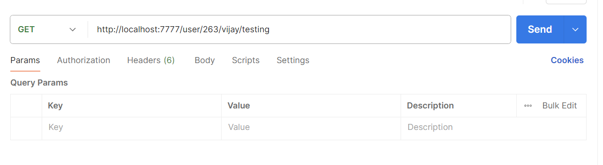

learned advanced learning methods

app.get("ab+c", (req, res) => {
  res.send({ firstname: "Vijay", lastName: "Sivakadatcham" });
});
app.get("ab*c", (req, res) => {
  res.send({ firstname: "Vijay", lastName: "Sivakadatcham" });
});

app.get("a(bc)+d", (req, res) => {
  res.send({ firstname: "Vijay", lastName: "Sivakadatcham" });
});

app.get(/a/, (req, res) => {
  res.send({ firstname: "Vijay", lastName: "Sivakadatcham" });
});

app.get(/.*user$/, (req, res) => {
  res.send({ firstname: "Vijay", lastName: "Sivakadatcham" });
});

Regex

req.query

